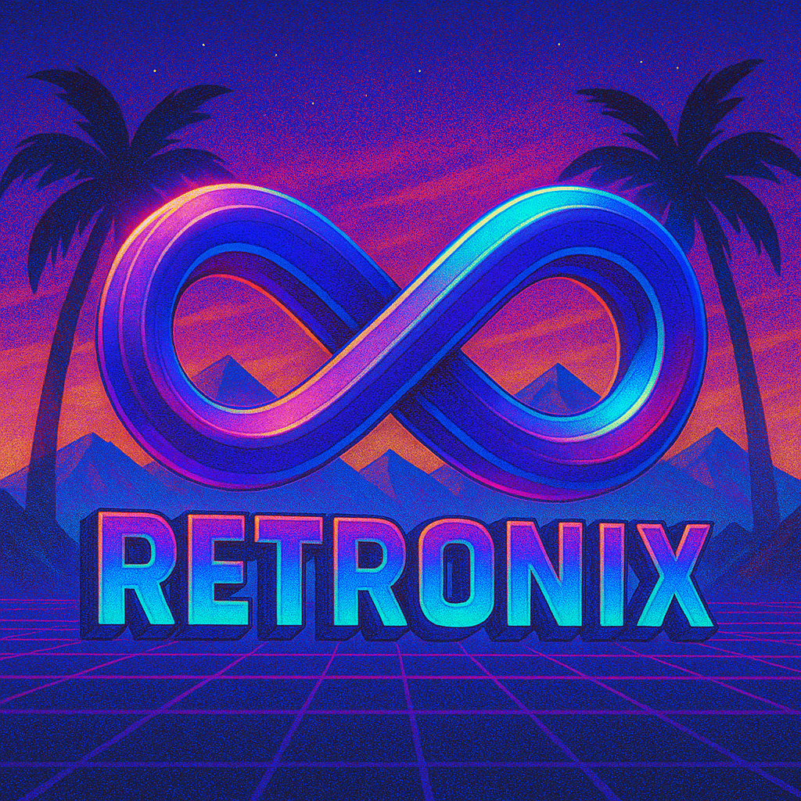

# 🎮 Retronix Wallpapers

<div align="center">



**Premium Retro & Vaporwave Wallpapers in 4K**  
*Bringing nostalgic aesthetics to modern devices*

[](https://retronixwallpapers.com)
[](https://reactjs.org/)
[](https://firebase.google.com/)
[](https://stripe.com/)
[](https://netlify.com/)

</div>

## 🌟 Overview

Retronix is a subscription-based wallpaper platform that delivers high-quality **4K retro and vaporwave wallpapers** to users worldwide. The platform features both static and live wallpapers, with a sophisticated tiered subscription system powered by Stripe payments and Firebase authentication.

### 🎯 Key Features

- **🎨 Premium Wallpaper Collection**: 600+ wallpapers across static and live categories
- **💳 Flexible Subscription Tiers**: Free, Static Pro ($2.99), Live Pro ($4.99), Premium Pro ($6.99)
- **🔐 Secure Authentication**: Firebase Auth with email verification and Google OAuth
- **💎 Seamless Payments**: Stripe integration for one-time lifetime subscriptions
- **📱 Responsive Design**: Optimized for desktop, tablet, and mobile devices
- **⚡ Performance Optimized**: Lazy loading, SEO optimization, and CDN delivery
- **🎥 Live Wallpapers**: High-quality MP4 wallpapers with Plash integration for macOS
- **🔄 Weekly Updates**: Automated wallpaper rotation with seeded shuffling algorithm

## 🏗️ Architecture

### Frontend Stack
- **React 19.1.0** with Vite for fast development and builds
- **React Router DOM** for client-side routing
- **Lucide React** for modern iconography
- **React Helmet Async** for SEO optimization
- **Custom CSS** with retro neon styling

### Backend & Services
- **Firebase Authentication** - User management and security
- **Firestore Database** - User data and subscription tracking
- **Stripe Payments** - Secure payment processing
- **Netlify Functions** - Serverless API endpoints
- **Supabase Storage** - Live wallpaper hosting and delivery
- **Cloudflare R2** - Static wallpaper storage

### SEO & Performance
- **Structured Data** - Rich snippets for search engines
- **Meta Tags** - Optimized for social sharing
- **Sitemap Generation** - Automated SEO indexing
- **Lazy Loading** - Performance optimization
- **Image Optimization** - WebP and responsive images

## 📁 Project Structure

```
Retronix-Startup/
├── 📱 retronix/                    # Main React application
│   ├── 📄 src/
│   │   ├── 🧩 components/          # Reusable UI components
│   │   │   ├── Navbar.jsx          # Navigation component
│   │   │   ├── WallpaperCard.jsx   # Wallpaper display component
│   │   │   ├── LiveGrid.jsx        # Live wallpaper grid
│   │   │   ├── StaticGrid.jsx      # Static wallpaper grid
│   │   │   └── PremiumGrid.jsx     # Premium wallpaper grid
│   │   ├── 📄 pages/               # Application pages
│   │   │   ├── Home.jsx            # Landing page
│   │   │   ├── Pricing.jsx         # Subscription plans
│   │   │   ├── Wallpapers.jsx      # Wallpaper gallery
│   │   │   ├── About.jsx           # About page
│   │   │   └── Account.jsx         # User authentication
│   │   ├── 🔧 utils/               # Utility functions
│   │   │   ├── seoUtils.js         # SEO optimization
│   │   │   └── videoUtils.js       # Video handling
│   │   └── 🔥 firebase/            # Firebase configuration
│   ├── 🌐 netlify/functions/       # Serverless functions
│   │   └── create-checkout-session.js
│   ├── 📊 public/                  # Static assets
│   │   ├── *.json                  # Wallpaper data files
│   │   └── *.mp4                   # Demo videos
│   └── 📜 scripts/                 # Build automation
│       ├── generate-sitemap.js
│       └── generate-robots.js
├── 🛠️ extras/                      # Additional tools and utilities
│   ├── 🔥 functions/               # Firebase functions
│   ├── 🌊 r2-link-dumper/          # Cloudflare R2 utilities
│   └── 📊 retronix-live/           # Live wallpaper app
└── 📄 Configuration files
    ├── package.json
    ├── vite.config.js
    └── netlify.toml
```

## 🚀 Getting Started

### Prerequisites

- **Node.js** 18+ and npm
- **Firebase** project with Authentication and Firestore
- **Stripe** account for payments
- **Netlify** account for deployment

### Installation

1. **Clone the repository**
   ```bash
   git clone https://github.com/CapChris20/Retronix-Wallpapers-Startup.git
   cd Retronix-Startup
   ```

2. **Install dependencies**
   ```bash
   cd retronix
   npm install
   ```

3. **Configure environment variables**
   Create a `.env` file in the `retronix` directory:
   ```env
   VITE_FIREBASE_API_KEY=your_firebase_api_key
   VITE_FIREBASE_AUTH_DOMAIN=your_firebase_auth_domain
   VITE_FIREBASE_PROJECT_ID=your_firebase_project_id
   VITE_FIREBASE_STORAGE_BUCKET=your_firebase_storage_bucket
   VITE_FIREBASE_MESSAGING_SENDER_ID=your_firebase_messaging_sender_id
   VITE_FIREBASE_APP_ID=your_firebase_app_id
   VITE_FIREBASE_MEASUREMENT_ID=your_firebase_measurement_id
   VITE_STRIPE_PUBLISHABLE_KEY=your_stripe_publishable_key
   VITE_SUPABASE_URL=your_supabase_url
   VITE_SUPABASE_ANON_KEY=your_supabase_anon_key
   ```

4. **Start development server**
   ```bash
   npm run dev
   ```

5. **Build for production**
   ```bash
   npm run build
   ```

## 🔧 Configuration

### Firebase Setup

1. **Create a Firebase project** at [Firebase Console](https://console.firebase.google.com)
2. **Enable Authentication** with Email/Password and Google providers
3. **Create Firestore database** in production mode
4. **Configure Firestore rules**:
   ```javascript
   rules_version = '2';
   service cloud.firestore {
     match /databases/{database}/documents {
       match /users/{userId} {
         allow read, write: if request.auth != null && request.auth.uid == userId;
       }
     }
   }
   ```

### Stripe Configuration

1. **Create products and prices** in Stripe Dashboard
2. **Set up webhook endpoints** for payment processing
3. **Configure success/cancel URLs** for checkout sessions

### Netlify Functions

The project includes serverless functions for:
- **Stripe Checkout Session Creation** - Handles subscription payments
- **Video Proxy** - CORS-free video streaming from Supabase

## 📊 Subscription Tiers

| Tier | Price | Features |
|------|-------|----------|
| **Free** | $0 | 3 rotating static wallpapers weekly |
| **Static Pro** | $2.99 | 250+ static wallpapers, lifetime access |
| **Live Pro** | $4.99 | 350+ live wallpapers, MP4 format |
| **Premium Pro** | $6.99 | All wallpapers + future updates |

## 🎨 Wallpaper Management

### Data Structure

Wallpapers are stored in JSON format with the following structure:

```json
{
  "title": "Wallpaper Name",
  "type": "static|live",
  "tier": "Free|Static Pro|Live Pro|Premium Pro",
  "category": "vaporwave|retro|synthwave",
  "thumbnail": "https://example.com/thumb.jpg",
  "download": "https://example.com/wallpaper.jpg",
  "preview": "https://example.com/preview.mp4",
  "plashURL": "https://example.com/plash-link"
}
```

### Automated Features

- **Weekly Rotation**: Seeded shuffling algorithm ensures consistent wallpaper rotation
- **SEO Optimization**: Automatic meta tag generation and structured data
- **Performance**: Lazy loading and image optimization

## 🚀 Deployment

### Netlify Deployment

1. **Connect repository** to Netlify
2. **Configure build settings**:
   - Build command: `npm run build`
   - Publish directory: `retronix/dist`
3. **Set environment variables** in Netlify dashboard
4. **Deploy functions** to handle payments and video streaming

### Firebase Functions

Deploy serverless functions for payment processing:

```bash
cd extras/functions
npm install
firebase deploy --only functions
```

## 🧪 Development

### Available Scripts

```bash
# Development
npm run dev          # Start development server
npm run build        # Build for production
npm run preview      # Preview production build

# SEO
npm run sitemap      # Generate sitemap
npm run robots       # Generate robots.txt

# Linting
npm run lint         # Run ESLint
```

### Code Style

- **ESLint** configuration for code quality
- **Prettier** for consistent formatting
- **React Hooks** for state management
- **Functional Components** throughout

## 🤝 Contributing

We welcome contributions! Please follow these steps:

1. **Fork the repository**
2. **Create a feature branch**: `git checkout -b feature/amazing-feature`
3. **Commit changes**: `git commit -m 'Add amazing feature'`
4. **Push to branch**: `git push origin feature/amazing-feature`
5. **Open a Pull Request**

### Contribution Guidelines

- Follow the existing code style
- Add tests for new features
- Update documentation as needed
- Ensure all builds pass

## 📈 Performance Metrics

- **Lighthouse Score**: 95+ across all categories
- **Core Web Vitals**: Optimized for Google rankings
- **SEO Score**: 100/100 with structured data
- **Load Time**: <2s on 3G connections

## 🔒 Security

- **Firebase Security Rules** for data protection
- **Stripe PCI Compliance** for payment security
- **HTTPS Everywhere** with SSL certificates
- **Input Validation** and sanitization

## 📞 Support

- **Website**: [retronixwallpapers.com](https://retronixwallpapers.com)
- **Email**: support@retronixwallpapers.com
- **Documentation**: Check the FAQ page for common questions

## 📄 License

This project is licensed under the **MIT License** - see the [LICENSE](LICENSE) file for details.

## 🙏 Acknowledgments

- **Retrowave Community** for inspiration
- **Firebase** for backend services
- **Stripe** for payment processing
- **Netlify** for hosting and functions
- **Supabase** for storage solutions

---

<div align="center">

**Made with ❤️ by the Retronix Team**

*Bringing retro vibes to the modern web*

[](https://github.com/CapChris20)

</div>
